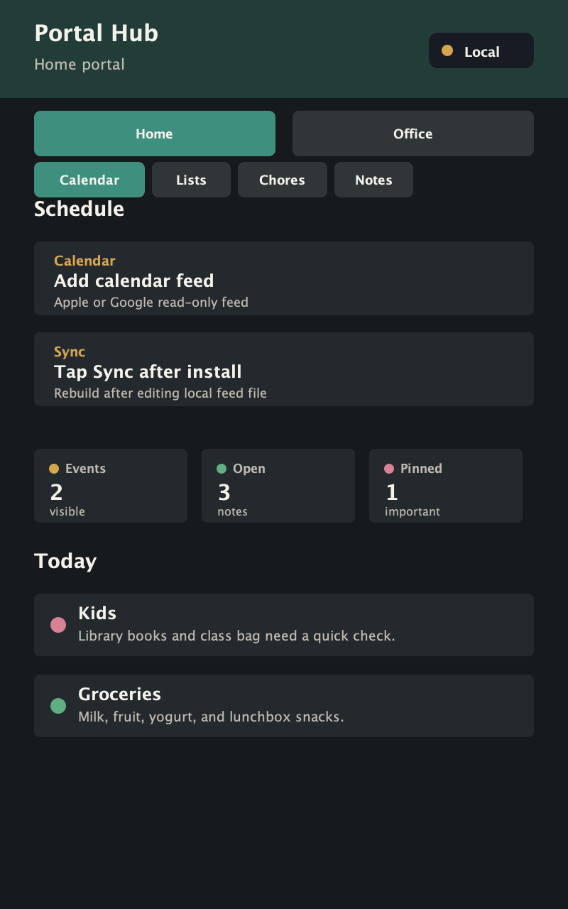
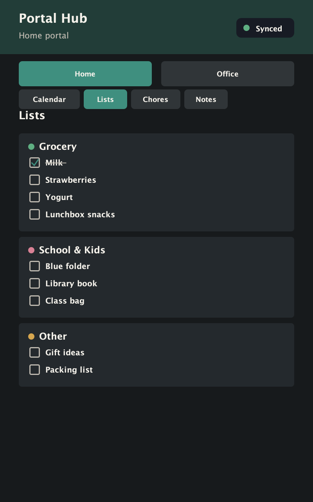
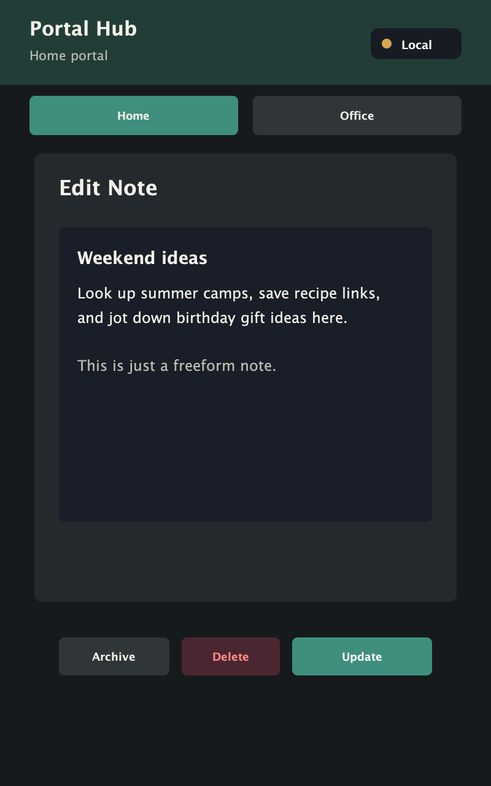

# Portal Hub

Turn an old Portal smart display into a useful local-first household or office dashboard.

Portal hardware is discontinued, but the device is still a capable Android touch display. This project repurposes it as an offline-friendly command surface for notes, reminders, schedules, routines, and optional backend sync.

## Screenshots

These screenshots use sanitized sample data and match the 800 x 1280 Portal display shape.

| Home calendar | Home lists | Note editor |
| --- | --- | --- |
|  |  |  |

## What It Does

- Home and Office dashboard modes
- Local notes with person, category, due date, pinned state, and status
- Add, edit, done, undo, archive, and delete
- Local persistence on the Portal with `SharedPreferences`
- Read-only schedule section
- Optional read-only `.ics` calendar feed support
- Music/routine suggestion buttons
- Optional Node backend for sync and markdown export
- Rule-based assistant summaries with optional local-model fallback
- Per-device mode memory for multi-Portal setups

## Privacy Model

The Android app works locally without a backend. Calendar feeds and backend sync are optional.

Do not commit private calendar URLs, names, screenshots, generated UI dumps, API keys, or local machine paths. Use placeholders in public code and keep personal feeds in your own private build/config.

## Build And Install

From this directory:

```bash
./gradlew assembleDebug
adb install -r app/build/outputs/apk/debug/app-debug.apk
adb shell am start -n com.monikabele.portalhub/.MainActivity
```

The APK is written to:

```text
app/build/outputs/apk/debug/app-debug.apk
```

## Calendar Feeds

The app supports read-only `.ics` / `webcal://` calendar feeds. The public repo ships without private calendar URLs.

Copy the example asset to a local-only file:

```bash
cp app/src/main/assets/calendar-feeds.example.json app/src/main/assets/calendar-feeds.local.json
```

Then edit `calendar-feeds.local.json` with your private Apple and/or Google read-only calendar feed URLs. This file is ignored by Git. `webcal://` links are converted to `https://` before fetch.

Recommended setup:

- Create a dedicated calendar for Portal-safe events.
- Share only events you are comfortable displaying on a household screen.
- Use the read-only public/subscription link.
- Avoid exposing your full personal calendar.

## Optional Backend

Start the local backend:

```bash
node backend/server.mjs
```

It listens on:

```text
http://127.0.0.1:8787
```

Useful endpoints:

```text
GET    /health
GET    /api/portal/home
GET    /api/portal/office
PUT    /api/portal/home/notes
PUT    /api/portal/office/notes
POST   /api/notes
POST   /api/notes/:id/done
POST   /api/notes/:id/reopen
POST   /api/notes/:id/archive
DELETE /api/notes/:id
GET    /api/agents/home/summary?mode=home
GET    /api/agents/execution/summary?mode=home
```

## USB Sync Testing

While the Portal is connected over USB, use `adb reverse` so the Portal can reach your laptop backend as `127.0.0.1`:

```bash
adb reverse tcp:8787 tcp:8787
```

Then tap `Sync` or an assistant button in the Portal app.

Without the backend, the app still works locally and shows `Offline` after a failed sync attempt.

## Markdown Output

The backend writes generated markdown to:

```text
../personal-os/home/portal-notes.md
../personal-os/home/groceries.md
../personal-os/family/portal-reminders.md
../personal-os/career/portal-notes.md
```

These files are projections of backend JSON state. Edit notes from the Portal/API, not directly in the generated files.

## Local Model Summaries

Assistant summaries use deterministic local rules by default. To route summaries through an Ollama-compatible local model, start your model server and run:

```bash
LOCAL_MODEL_URL=http://127.0.0.1:11434/api/generate \
LOCAL_MODEL_NAME=llama3.2 \
node backend/server.mjs
```

If the local model is unavailable, the backend falls back to rule-based summaries.

## Two Portal Setup

Each Portal remembers its selected mode:

- Home Portal: choose `Home`
- Office Portal: choose `Office`

After selection, relaunching the app keeps that device in its chosen mode.

## Roadmap

See [docs/ROADMAP.md](docs/ROADMAP.md).

## Regenerate Screenshots

The checked-in screenshots are generated from sanitized sample content:

```bash
javac tools/RenderScreenshots.java
java -Djava.awt.headless=true -cp tools RenderScreenshots
```
